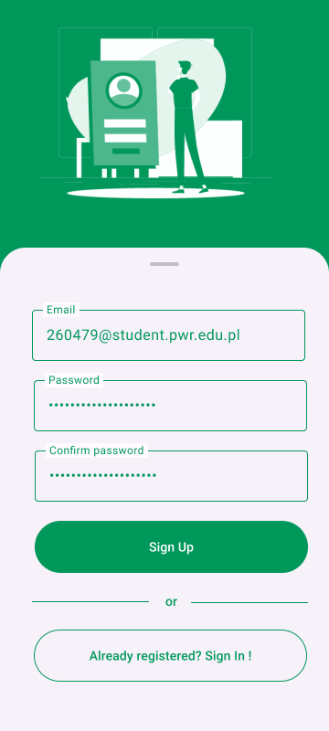
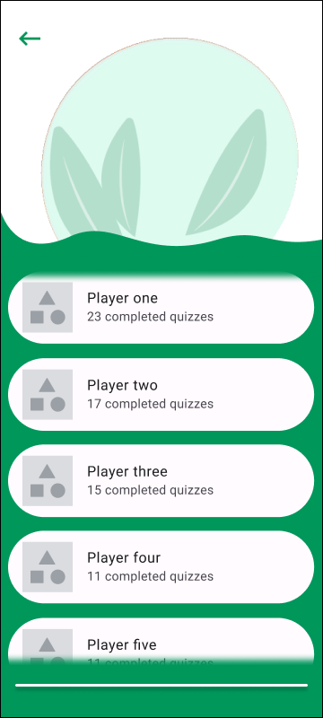
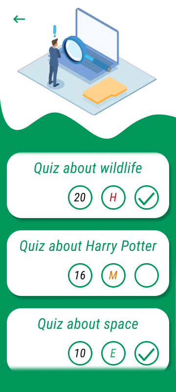
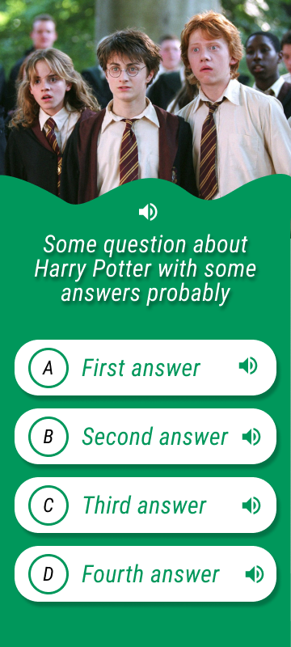
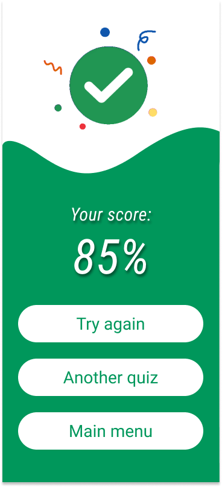
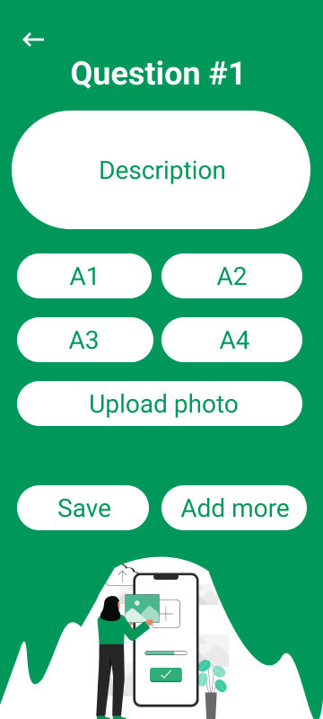

# Poquizowane

## Introduction
### 1.1.	Title
The title of our application is Poquizowane
### 1.2.	About application
Poquizowane is an interactive and comprehensive quiz application designed for users seeking to enhance their knowledge through a diverse selection of quizzes. The application enables users to create individual accounts, ensuring personalized experiences and the ability to monitor progress over time.

### 1.3.	Key features
- Account Creation: Users can register for individual accounts, allowing them to save progress and access app content.
- Quiz Library: The application offers an extensive library of quizzes, spanning a wide range of topics and difficulty levels, ensuring a suitable challenge for users of all skill levels.
- Leaderboard: The Poquizowane application includes a leaderboard feature, allowing users to compare their performance with other.
- Quiz Creation: Users have the ability to create custom quizzes, tailoring content to their interests or specific areas of expertise. These quizzes can be shared with the others.
- Play Quizzes: The application provides a seamless and user-friendly interface for participating in quizzes, facilitating an enjoyable and educational experience for users.

### 2.	UX Design
1. Splash screen

2. Login Screen

3. Sign up screen

4. Main screen

5. Leader board

6. Quiz Library

7. Quiz Question

8. Quiz summary

9. Create quiz – basic info text field for entering difficulty level of the quiz

10. Create quiz – add questions

